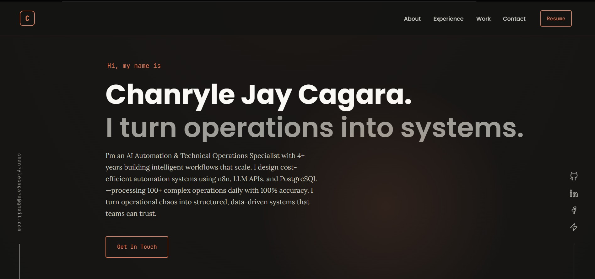

# 👨‍💼 Chanryle Jay Cagara — Portfolio

<div align="center">

[](https://chanryle-cagara.vercel.app/)
[]()
[]()
[]()
[]()

Personal portfolio showcasing projects, expertise, and professional background. Built with passion for automation, reliability, and elegant solutions.

</div>

---

## 🎯 About Me

**Automation Engineer** — Building production-grade automation systems with **n8n**, **PostgreSQL**, **Telegram APIs**, and **AI-assisted design** patterns. Starting my journey in automation engineering, passionate about solving complex problems through elegant, cost-effective solutions.

### 🏆 Key Achievement
Engineered a **zero-cost, 48-node error monitoring system** that replaced a $1.40/month AI-powered predecessor — demonstrating that intelligent architecture beats expensive tools.

---

## 🛠️ Tech Stack

| Category | Technologies |
|----------|---------------|
| **Frontend** | HTML5, CSS3, Vanilla JavaScript |
| **Infrastructure** | Vercel, n8n, PostgreSQL |
| **Integrations** | Telegram API, Email automation, REST APIs |
| **Specialization** | Production automation, Zero-cost monitoring, AI workflows |

---

## 🚀 Featured Projects

### 1. **n8n Project Calculator**
**AI-Powered Project Cost Estimator**
- Estimates build cost, hosting, and complexity for n8n projects
- Two modes: Quick Estimate (dropdowns) + AI Estimate (plain English)
- The only tool like this that exists
- [→ Live App](https://n8n-project-calculator.vercel.app) | [→ Repository](https://github.com/chanrylejay/n8n-project-calculator)

### 2. **Supervisor Error Handling Workflow**
**Production Monitoring Done Right — Zero Cost**
- 3 integrated workflows with 48 strategic nodes
- 22 audit rounds for bulletproof reliability
- $0/month infrastructure cost
- [→ View Repository](https://github.com/chanrylejay/supervisor-error-handling-workflow)

### 3. **Shiny Gmail Automation**
**Intelligent Email Management Meets Telegram**
- AI-powered email categorization with Gemini
- Native Telegram bot interface for rule management
- 3 workflows, 60 nodes, 7 smart labels
- [→ View Repository](https://github.com/chanrylejay/shiny-gmail-automation)

## 📸 Portfolio Preview



---

## 🚀 Quick Start

To view this portfolio locally:

```bash
# Clone the repository
git clone https://github.com/chanrylejay/my-portfolio-v1.git

# Navigate to the project
cd my-portfolio-v1

# Open in your browser
open index.html
# or on Linux/Windows
# xdg-open index.html / start index.html
```

**Live version:** [chanryle-cagara.vercel.app](https://chanryle-cagara.vercel.app/)

---

## 📱 Connect With Me

| Platform | Link |
|----------|------|
| **GitHub** | [@chanrylejay](https://github.com/chanrylejay) |
| **LinkedIn** | [Chanryle Cagara](https://ph.linkedin.com/in/chanryle-cagara-b31922185) |
| **Email** | [See LinkedIn](https://ph.linkedin.com/in/chanryle-cagara-b31922185) |

---

## 📄 License

This project is open source. See `LICENSE` file for details.

---

<div align="center">

**⭐ If you found this portfolio inspiring, consider leaving a star!**

</div>
